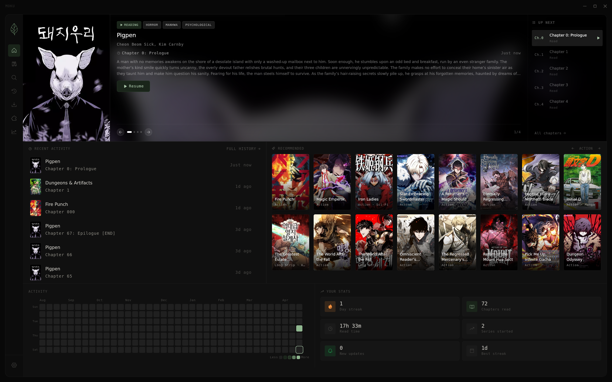
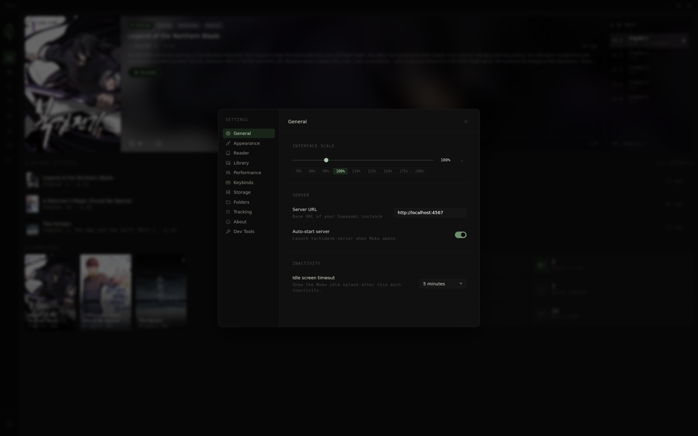
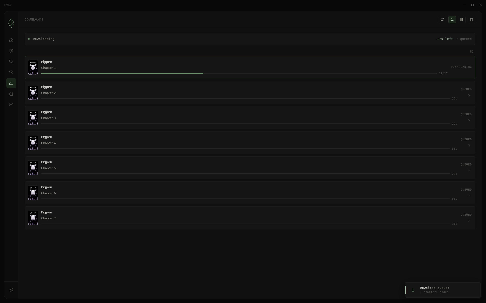
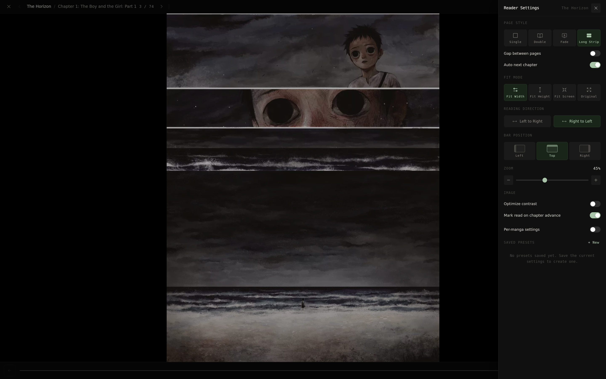

<div align="center">
  
</div>

<div align="center">

[](https://github.com/Youwes09/Moku/releases/latest)
[](https://github.com/Youwes09/Moku/releases/latest)
[](./LICENSE)
[](https://discord.gg/x97hj8zR72)

</div>

<br/>

Moku is a fast, minimal manga reader frontend for [Suwayomi-Server](https://github.com/Suwayomi/Suwayomi-Server). It wraps Suwayomi's GraphQL API in a lightweight Tauri app — no Electron overhead.

---

## Screenshots

<div align="center">
  
</div>

<div align="center">
  
  
  
  
  
  
</div>

<div align="center">
  <a href="docs/screenshots" style="color: #a8c4a8;">View all screenshots →</a>
</div>

---

## Features

- **Library management** — organize manga into folders, track unread counts, filter by genre
- **Per-folder sorting & filtering** — each folder has its own independent sort (unread, A–Z, recently read, latest chapter, and more) and publication status filter (Ongoing, Completed, Hiatus, etc.)
- **Built-in reader** — single page, long strip, configurable fit modes, customizable keybinds
- **Markers** — pin color-coded notes to any page while reading; markers appear as dots on the progress bar and are browseable under Series Detail → Manage → Markers
- **Extension support** — install and manage Suwayomi extensions directly from the app
- **Download management** — queue and monitor chapter downloads with progress toasts
- **Automation** — pre-download titles automatically and optionally delete chapters after they're marked as read (accessible from Series Detail)
- **Discord Rich Presence** — shows the manga title, current chapter, and an elapsed timer in your Discord status; configurable in Settings → General
- **Auto-start server** — optionally launch Suwayomi in the background on startup
- **Multiple themes** — Dark, Light, Midnight, Warm, High Contrast, and more
- **Auto-updates** — in-app update checker with silent background notifications
- **Improved NSFW filtering** — expanded tag parser gives the Hide NSFW setting better coverage across sources

---

## Installation

### Windows

**winget:**

```powershell
winget install Moku.Moku
```

> Thanks to [@frozenKelp](https://github.com/frozenKelp) for setting up and maintaining the winget package through v0.9.0.

Or download the `.exe` installer from the [releases page](https://github.com/Youwes09/Moku/releases/latest). Suwayomi-Server and a JRE are bundled.

### Flatpak (Linux, recommended)

Suwayomi-Server and a bundled JRE are included — no separate install needed.

```bash
flatpak install moku.flatpak
flatpak run dev.moku.app
```

Download the latest `moku.flatpak` from the [releases page](https://github.com/Youwes09/Moku/releases/latest).

### Nix

```bash
nix run github:Youwes09/Moku
```

Add to your flake:

```nix
inputs.moku.url = "github:Youwes09/Moku";
```

### macOS

Download the `.dmg` from the [releases page](https://github.com/Youwes09/Moku/releases/latest).

> **Note:** Builds are ad-hoc signed. On first launch you may need to run:
> ```bash
> xattr -rd com.apple.quarantine /Applications/Moku.app
> ```

---

## Requirements

If you're not using the bundled Flatpak or Windows installer, [Suwayomi-Server](https://github.com/Suwayomi/Suwayomi-Server) must be running separately. By default Moku connects to `http://127.0.0.1:4567`.

You can point Moku at any Suwayomi instance — local or remote — via **Settings → General → Server URL**.

---

## Development

**Prerequisites:** [Rust](https://rustup.rs), [Node.js](https://nodejs.org), [pnpm](https://pnpm.io), and [Tauri v2 prerequisites](https://tauri.app/start/prerequisites/).

```bash
git clone https://github.com/Youwes09/Moku
cd Moku
pnpm install
pnpm tauri:dev
```

Or with Nix:

```bash
nix develop
pnpm install
pnpm tauri:dev
```

---

## Stack

| | |
|---|---|
| [Tauri v2](https://tauri.app) | Native app shell |
| [Svelte 5](https://svelte.dev) + [TypeScript](https://www.typescriptlang.org) | UI |
| [Vite](https://vitejs.dev) | Frontend bundler |
| [Crane](https://github.com/ipetkov/crane) | Nix Rust builds |

---

## Community

Questions, feedback, or just want to hang out — join the Discord.

[](https://discord.gg/x97hj8zR72)

---

## License

Distributed under the [Apache 2.0 License](./LICENSE).

---

## Disclaimer

Moku does not host or distribute any content. The developers have no affiliation with any content providers accessible through connected sources.
